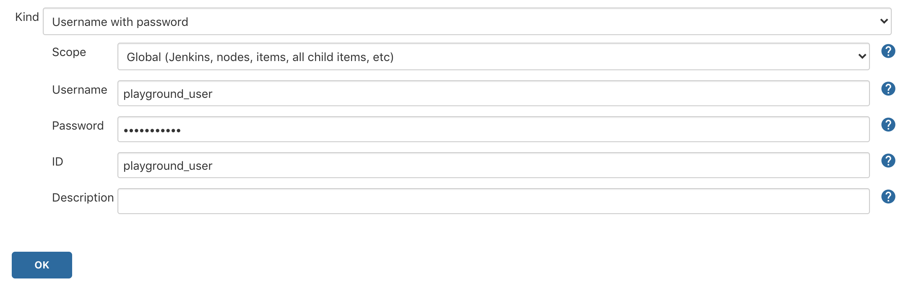
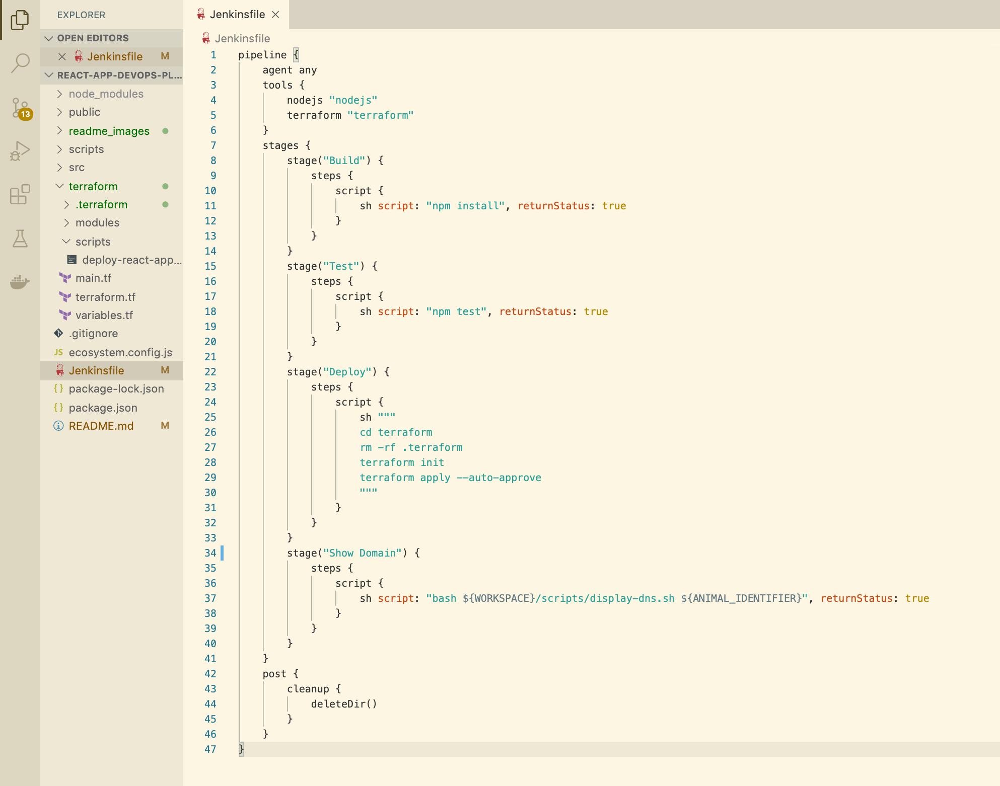
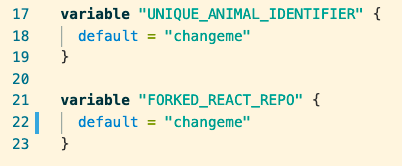

# Hands on with Jenkins, Terraform, AWS and React

For this playground, we will be building an automated CI/CD pipeline that deploys a **scalable** React web application to AWS. Here's an overview of what we'll cover:

- Write a Jenkins DSL (Domain Specific Language) script, which allows us to define our pipeline configuration as code (Configuration as Code).
- Trigger a build of this script which will create a new, empty pipeline that is configured with all the settings we need.
- Write *another* script for the newly created pipeline which will define the various stages our application needs to go through before being deployed to AWS. These include:
    - Building the application.
    - Testing it.
    - Deploying it to an AWS autoscaling group using terraform (Infrastructure as Code).

Still with me? Ok, lets get to it...

# Initial setup

If you don't already have a GitHub account then please sign up [here](https://github.com/join?ref_cta=Sign+up&ref_loc=header+logged+out&ref_page=%2F&source=header-home).

We will be using one repository for this playground:
1. The [react-app-devops-playground](https://github.com/richieganney/react-app-devops-playground) repository. This is the repository you're currently in, and it contains all the application code and scripts that we will need to actually deploy the web app to AWS.

You will also have a Jenkins server that the playground team have spun up for you this evening...(instructions on how to reach their server)

# Section 1 - the first script: build the Configuration as Code script.

First and foremost, you all need your own forked repository so you all have your own individual repos you can commit to.

### 1. Fork the repository
Go to the [react-app-devops-playground](https://github.com/richieganney/react-app-devops-playground) and click `fork`


Navigate to the forked repository and click in the `jobs` folder. You should see an empty file called `DeployReactApp.groovy`

### 2. Copy and paste the code below into the file

For this tutorial I will be using the command line and VS Code, but if you feel more comfortable using the GitHub user interface then feel free to use that.

> IMPORTANT: Make sure you change the ANIMAL_IDENTIFIERs `defaultValue`, "changeme", to whatever your animal identifier is.

```
pipelineJob("Deploy-React-App"){
    description("Deploys a React web application to AWS")
    logRotator {
        daysToKeep(5)
        numToKeep(20)
    }
    concurrentBuild(allowConcurrentBuild = false)
    triggers {
        scm("* * * * *"){
            ignorePostCommitHooks(ignorePostCommitHooks = false)
        }
    }
    parameters {
      stringParam("ANIMAL_IDENTIFIER", defaultValue = "changeme", description = "Your unique animal identifier for this playground!")
    }
    definition {
    cpsScm {
      scm {
        git {
          branch("${BRANCH_TO_BUILD}")
          remote {
            credentials("${GIT_USER}")
            url("${GIT_URL}")
          }
        }
      }
      scriptPath('Jenkinsfile')
    }
  }
}
```

# Whats happening here?
#### a. `pipelineJob("Deploy-React-App"){}`

The `pipelineJob(){}` block specifies that we want our CI/CD pipeline to be of type "pipeline". There are many types of Jenkins pipelines to choose from, such as:

- Freestyle project
- Pipeline (the one we'll be using)
- Maven project
- Multi-configuration project
- Multibranch pipeline

which would all require different syntax.

#### b. `description("Deploys a React web application to AWS")`

This is purely for clarity so people who use this pipeline actually know what it does.

#### c. `logRotator {daysToKeep(5)numToKeep(20)}`

When a build is triggered, it creates an instance of that pipeline, or a "job". These jobs have logs which are necessary for debugging and other purposes.

The `logRotator{}` block specifies how many job logs you want to keep, and for how many days they should be kept. The numbers will vary depending on the requirements, so we'll just leave it at 5 and 20.

#### d. `concurrentBuild(allowConcurrentBuild = false)`

There are many instances when you would want to **allow** concurrent builds, such as if multiple engineers were using the same pipeline to deploy to different components in different environments at the same time, but that won't be necessary for this pipeline so we'll disallow it.

#### e. `triggers {}`

With the `triggers {}` block we can automate the jobs by specifying when we want it to be built. The `* * * * *` inside the `scm()` function tells Jenkins to check the application repository every minute. If there has been a code change to the master branch in that minute, it will trigger a build.

Say something about `ignorePostCommitHooks()`

#### f. `parameters {}`

the `parameters {}` block allows us to define any parameters we want our pipeline to accept. You have all been given a `UNIQUE_ANIMAL_IDENTIFIER` for this playground, and we'll be using it so you all have a unique domain name and can therefore visit your deployed website with no duplicates.

#### g. `definition {}`

Here we are using the `definition {}` block to specify the Git repository. You will notice three variables that we will be passing into the seed job when we build it:

- `BRANCH_TO_BUILD`: this specifies which branch in the React repository we will be building.
- `GIT_USER`: this will be the credentials to your personal GitHub account so Jenkins can pull down the repo (don't worry, we haven't configured this yet).
- `GIT_URL`: this is the url of your forked [react-app-devops-playground](https://github.com/richieganney/react-app-devops-playground) repository.

The `scriptPath('')` function defines the file path to the pipeline script that will be used to deploy our application. We'll come back onto this in Section 3

# How to commit and push to master?

1. If you haven't already done so, pull down your **forked** [react-app-devops-playground](https://github.com/richieganney/react-app-devops-playground) repository and cd into it. In your terminal, run:
```
git pull <FORKED_REPOSITORY>
cd <FORKED_REPOSITORY>
```
Replace `<FORKED_REPOSITORY>` with your forked repository. You can copy the url of the repository from the GitHub user interface like so:


2. Open the repository in your text editor (I'm using VS Code) and click on the `DeployReactApp.groovy` script.


3. Copy the entire script and paste it into the file. Make sure the `defaultValue` of `UNIQUE_ANIMAL_IDENTIFIER` has been changed.


4. Add the file to git, commit it and push it to the master branch. In your terminal, in the root directory of the repository, run the following commands:

```
git add .
git commit -m "Populating the Jenkins seed job script"
git push -u origin master
```

Now let's move onto section 2...

# Section 2: Configure Jenkins and then build the seed job.

In this section we will:
- Add our GitHub credentials to Jenkins globally so that it can interact with our repositories.  
- Configure Jenkins to use NodeJS so it can build and test our React application.
- Configure Jenkins with Terraform so it can run `terraform` commands.
- Configure Jenkins with AWS so it can deploy our application.

Let's dive straight in...

### 1. Configure GitHub credentials gloablly

Once logged into Jenkins, enter your admin password and select the **Install Suggested Plugins** option. Then, click... 
- **Manage Jenkins > Manage Credentials**
- Click **Jenkins** under **Stores scoped to Jenkins** 
- Click **Global credentials** 
- Click **Add Credentials** on the left 


- Fill in the fields with your personal GitHub credentials (username and password). 
> **IMPORTANT: make sure you put your username in the ID section**. 
You can leave description blank.

### 2. Configure Jenkins to use NodeJS so that our application pipeline can use `npm` commands.

All of the plugins for this playground have been pre-installed on your Jenkins server, we just need to tell Jenkins to use them now.

- Go to the Jenkins homepage and navigate to **Jenkins > Manage Jenkins > Global Tool Configuration**


- Scroll down and select **NodeJS installations...**


- Select **Add NodeJS** and fill in the fields with the following details:

    - Name: **nodejs**
    - Install automatically: (box checked)
    - Version: (leave as default)
    - Global npm packages to install: **npm install**
    - Global npm packages refresh hours: **72**
- Click **Apply**

### 3. Configure Jenkins to use Terraform so that our application can use `terraform` commands.

- While we are still in the **Global Tool Configuration** part of Jenkins, scroll down past the NodeJS installations and click **Terraform installations**

- Select **Add Terraform** and fill in the fields with the following details:

    - Name: **terraform**
    - Install Automatically: (box checked)
    - Version: **Terraform 0.13.3 linux (amd64)**
- Click **Save** which will take you back to the homepage.

### 4. Configure Jenkins with an AWS region so it knows where to deploy it to. Navigate to:

- **Manage Jenkins > Configure System**


- Scroll down to where is says **Global properties** and check the box that says **Environment variables**


- Fill in the fields with the following information:
    - Name: **AWS_DEFAULT_REGION**
    - Value: **eu-west-1**

- Click save and we are done with the Jenkins configuration!

Now we have added NodeJS, Terraform and AWS to our Jenkins, let's go ahead and actually create the seed job...

### 5. Create a new item

This will hold the Groovy code that will build our CI/CD pipeline.

- Click **New Item** located at the top left of the window.
- Name the item **seed-job** and select **Freestyle project** as the option. Hit **OK**. 
- Now we need to configure this pipeline:
    - Select **This project is parameterized** and add **THREE** string paramters by clicking **Add Parameter > String Parameter** 
    - Add the three variables we saw in Section 1, which were `BRANCH_TO_BUILD`, `GIT_USER` and `GIT_URL`. Leave **Default Value** and **Description** blank.
    - In the **Source Code Management** section, select the **Git** radio button. Fill in **Repository URL** with your forked [react-app-devops-playground](https://github.com/richieganney/react-app-devops-playground) repository and **Credentials** with your credentials that we configured earlier. . Leave the branch as master.
    - Lastly, we need to add a build step. In the **Build** section, select **Add build step > Process Job DSLs**. Fill in the **DSL Scripts** section with the file path to our DSL script. The path is `jobs/DeployreactApp.groovy` and it will look like this: 
    Click **Save** and the configuration is done!

Before we move onto part three of this section, we need to fork the [react-app-devops-playground](https://github.com/richieganney/react-app-devops-playground) repository, which is the one that holds the application code we need to deploy.

So in the same way we forked the Jenkins DSL repository earlier, follow the link above and fork it to your personal GitHub. We will need the URL of this forked repository in just a moment...

### 6. Build the seed job with parameters

Now go back to Jenkins so we can trigger a build to create our CI pipeline.

- Click the **seed-job** we just created, then select **Build with Parameters** on the left.

- Fill in the fields like so:
    - `BRANCH_TO_BUILD`: **master**
    - `GIT_USER`: the username to your personal GitHub
    - `GIT_URL`: the url of the *forked* [react-app-devops-playground](https://github.com/richieganney/react-app-devops-playground) repository. The image below shows how you can copy the url to your clipboard from the GitHub interface. 
- Select **Build**

The build will fail, but don't worry. If you check the logs of this build, you'll see this error message:
```
Processing DSL script jobs/DeployReactApp.groovy
ERROR: script not yet approved for use
Finished: FAILURE
```

We just need to approve the script. So...

### 7. Approve script and rebuild

- Navigate to **Jenkins > Manage Jenkins > In-process Script Approval**

- Select **Approve** at the top
- Go back to the seed job via **Jenkins > seed-job**
- Under the **Build History** section, click the red ball icon  which will take you straight to the build logs.
- Select **Rebuild** on the left hand side. It will take you to the **Build with Parameters** section with all the parameters pre-filled in from the last build.
- Click **Rebuild**

Now we should have a successful build. The most recent ball under **Build History** should be blue. If you click that ball you'll see the following message in the logs.

```
Existing items:
    GeneratedJob{name='Deploy-React-App'}
Finished: SUCCESS
```

If you go the Jenkins homepage you'll see our new pipeline `Deploy-React-App` which will have all the configuration we need. 

Now all we need to do is populate the `Jenkinsfile` and the `variables.tf` file in the forked [react-app-devops-playground](https://github.com/richieganney/react-app-devops-playground) repository, commit the code, and watch it deploy our application.

Onto Section 3...

# Section 3: populate the `Jenkinsfile` and the `variables.tf` file.

Pull down your [forked react repo](https://github.com/richieganney/react-app-devops-playground) to your local machine:

```
git pull <FORKED_REACT_REPO>
cd <FORKD_REACT_REPO>
```

1. Similar to how we populated the Jenkins DSL script, copy the code below paste it into the `Jenkinsfile` located in the root of this directory.

```
pipeline {
    agent any
    tools {
        nodejs "nodejs"
        terraform "terraform"
    }
    stages {
        stage("Build") {
            steps {
                script {
                    sh script: "npm install", returnStatus: true
                }
            }
        }
        stage("Test") {
            steps {
                script {
                    sh script: "npm test", returnStatus: true
                }
            }
        }
        stage("Deploy") {
            steps {
                script {
                    sh """
                    cd terraform
                    rm -rf .terraform
                    terraform init -backend-config="key=${ANIMAL_IDENTIFIER}.tfstate"
                    terraform apply --auto-approve
                    """
                }
            }
        }
        stage("Show Domain") {
            steps {
                script {
                    sh script: "bash ${WORKSPACE}/scripts/display-dns.sh ${ANIMAL_IDENTIFIER}", returnStatus: true
                }
            }
        }
    }
    post {
        cleanup {
            deleteDir()
        }
    }
}
```
# What's happening here?

### a. `pipeline {}`

All valid declarative pipelines must be enclosed within a `pipeline {}` block

### b. `agent any`

The agent section specifies where the entire Pipeline, or a specific stage, will execute in the Jenkins environment depending on where the agent section is placed. The section must be defined at the top-level inside the pipeline block, but stage-level usage is optional.

By writing "any" in the agent section we are telling Jenkins to run on any of the available nodes.

### c. `tools {}`

For this particular project, we'll need to use `npm` (node package manager) to build and test the application. This means we need to use a NodeJS installation in order to execute the `npm` command.

We also need to add the `terraform` into this block so that the pipeline can use terraform commands.

The "nodejs" and "terraform" strings are the installations that we configured on the Jenkins server in the previous section.

### d. `stage {}`

The stages section is where the bulk of the "work" described by a Pipeline will be located. At a minimum, it is recommended that stages contain at least one stage directive for each discrete part of the continuous delivery process, such as Build, Test, and Deploy.

For the "Build" and "Test" stages, we simply execute an `npm` command that will run in the workspace directory.

However for the "Deploy" stage we execute some terraform commands which do the following:
- `rm -rf .terraform`: removes any local state files if there are any located in the directory.
- `terraform init`: this initializes the terraform and tells terraform where we want to hold the [state](https://www.terraform.io/docs/state/index.html) remotely.
- `terraform apply --auto-approve`: this will apply the infrastructure that we have defined in the `terraform/` directory of this repository.

The "Show Domain" stage runs a script that you can have a look at in the `scripts/` directory of this repo. It passes your unique animal identifier to the script as an argument (the one we defined in the Jenkins DSL section) and runs an AWS CLI command to find your domain based on your animal value. At the end of the build you will see the domain at the bottom of the logs.

### e. `post {}`

The `post` section defines one or more additional steps that are run upon the completion of a Pipelines or stages run.

The `cleanup` runs after every other post condition has been evaluated, regardless of the Pipeline or stages status.

`deleteDir()` is a function built by jenkins that recursively deletes the current directory and its contents. This will help keep our workspace clean.

That is all we need to for the pipeline script. Let's go ahead and add the changes to the Jenkinsfile. There are a couple of other files we need to change, so we'll do that all in the next part...

### 2. Make changes to `Jenkinsfile` and the `variables.tf` file.

- Copy the entire script from this section and paste it into the `Jenkinsfile`


- Now navigate to the `terraform/` directory located in the root directory of this repo and open the `variables.tf` file. Change the default values of the following variables
    - **UNIQUE_ANIMAL_IDENTIFIER**: to your animal for this playground.
    - **FORKED_REACT_REPO**: your *forked* repository for this playground


By changing the values here we don't have to edit multiple files. Terraform will pass these values to the various files

### 3. Commit the code and push to the master branch.

We should now have made changes to the following files:
- `Jenkinsfile`
- `terraform/variables.tf`

Also, feel free to have a look at the files where the two variables you changed are being used...

- `terraform/terraform.tf`
- `terraform/modules/elb.tf`
- `terraform/scripts/deploy-react-application.sh`

Now commit the code and push to master by running the following commands in the root directory:

```
git add .
git commit -m "Populating the Jenkinsfile script and the terraform variables"
git push -u origin master
```

# Section 4: check deployed logs and visit website.

Now that we have pushed the changes, let's go back to Jenkins to see if the **Deploy-React-App** pipeline has a build running.

### 1. In Jenkins, click on the **Deploy-React-App** pipeline.
### 2. Under **Build History** you should see a build that has just been triggered.
> Note: It may or may not be running/complete just yet so just wait a moment for the most recent logs to appear.
### 3. Once your build has completed, click on the blue ball icon to go straight to the build logs.


You should see the output of all the various stages of our deployment.

### 4. At the bottom, you'll see the following message:
```
Application successfully deployed! Please visit http://<ELB_DOMAIN_NAME> in your browser to view it.
```
Click the link to see the deployed website!
> Note: it will take a couple of minutes for the application to deploy, so don't be alarmed if the link isn't working just yet. It will!

AWS lets you utilise resources such as [Amazon Route 53](https://www.google.com/search?q=route+53+aws&oq=route+53+aws&aqs=chrome..69i57j0l5j69i60l2.3169j0j7&sourceid=chrome&ie=UTF-8) to set up domains to your websites. Check out the link above for the documentation.

### While we wait..

It should be a couple of minutes until the website is live. While we wait, lets go through whats actually happening in the deployment stage just after the application has been built and tested.

At the beginning of the playground I mentioned we were deploying a *scalable* application. This means that AWS will scale up or scale down the number of servers we have in production depending on how much traffic there is to our site.

#### Our infrastructure
- **load balancer**: this will distribute traffic across our servers depending on the health and utilisation of those servers. If one is in poor health, it will redirect traffic to a healthy one.
- **autoscaling group**: this will automatically scale our application up/down depending on how we configure it. For this application, we have set our desired EC2 instance capacity to 1, and have told it to scale up to no more than 3 if necessary.
- Highly available and fault tolerant